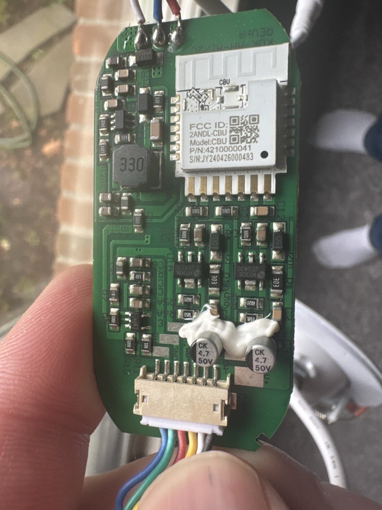
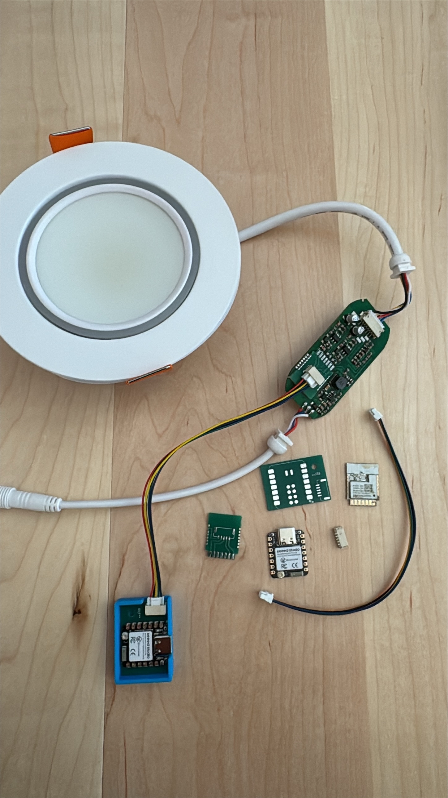
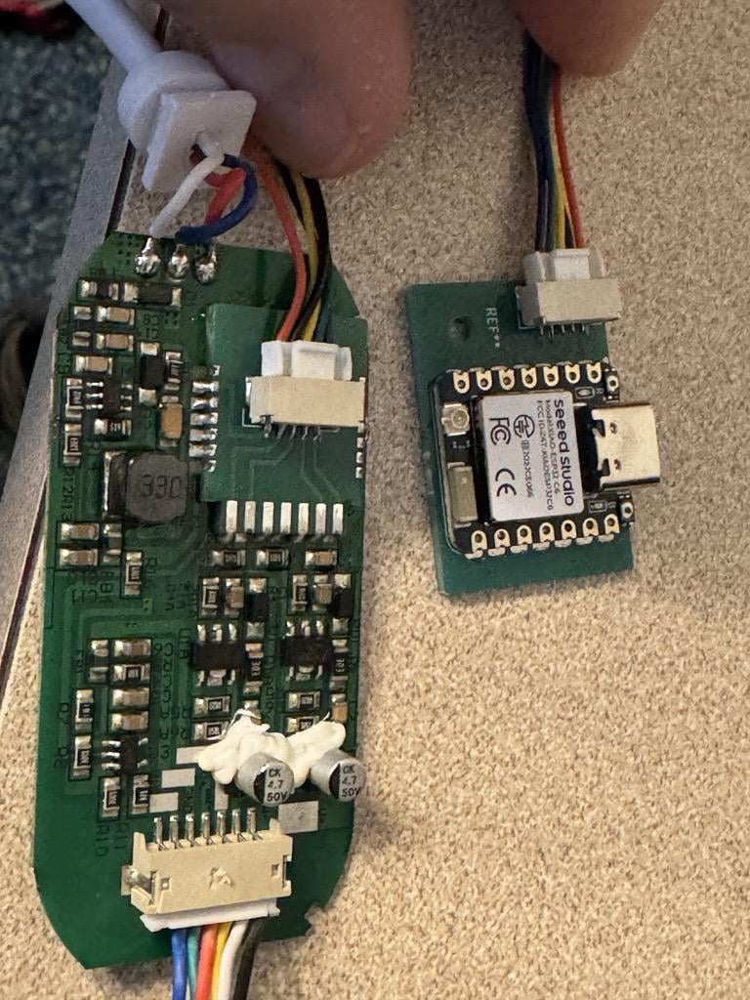
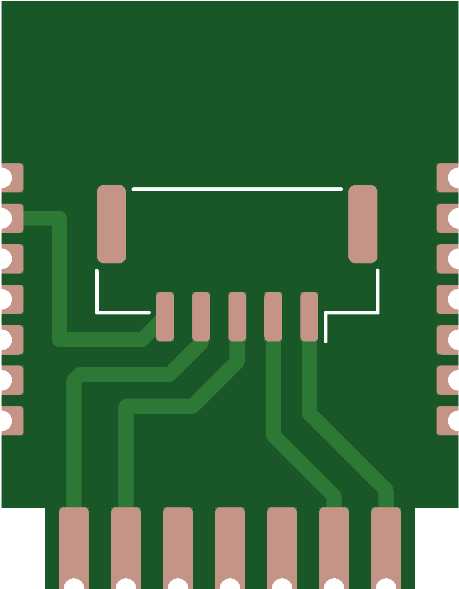
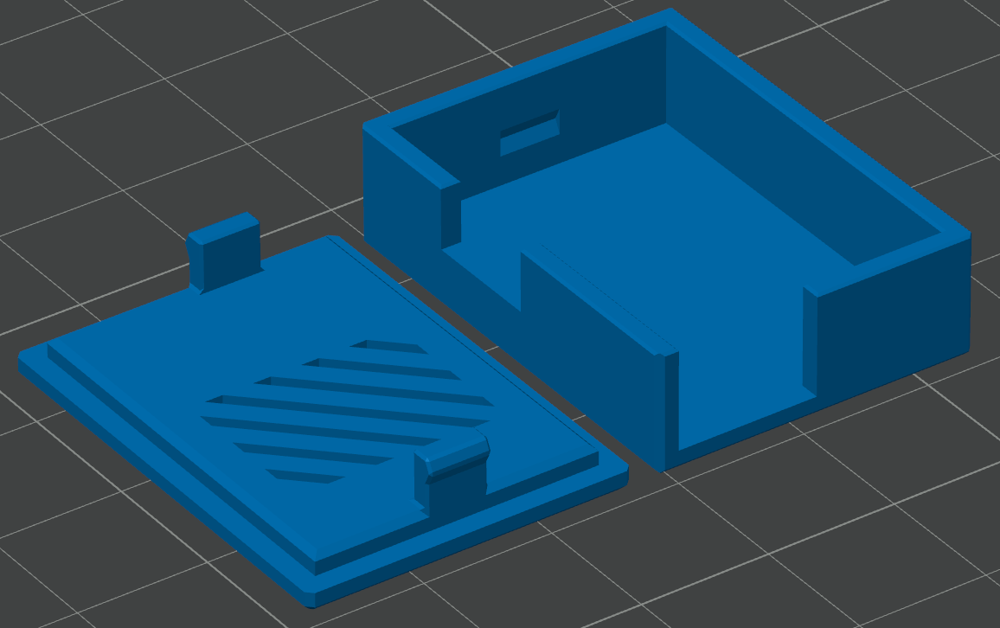

# Lumary RGBAI Teardown & Research Reference

Compiled from community teardowns and open-source projects during initial research.

---

## Photos

### 1. Original CBU Controller Board

The original controller board removed from the light. Key observations:
- **Chip:** Tuya CBU module (white rectangular module, top center) — BK7231N WiFi SoC
- **FCC ID:** 2ANDL-CBU, Model: CBU, P/N: 4210000041
- **Form factor:** Rounded/pill-shaped PCB, approximately 60×35mm
- **Connector:** Multi-pin JST connector at bottom (8–10 pins) — this connects to the LED wiring harness
- **Passives:** 330Ω resistor upper left, two 4.7µF 50V capacitors
- **Logic IC:** A08G AND gate (controls outer ring enable logic)
- This board lives in the **separate control box**, not inside the light body

---

### 2. Full Disassembly — All Parts

Complete teardown of a Lumary 6" RGBAI gimbal recessed light showing:
- **Top left:** Light fixture body (6" round white housing with trim ring)
- **Top right:** Original driver/controller PCB (long rectangular board) — connected by wire to the light body
- **Bottom center:** Several custom replacement PCBs laid out (the zimmer62 ESP32-C6 replacement boards)
- **Blue module:** Small Zigbee/BLE module
- **Orange flex cable:** Flat flex cable connecting light body to driver board
- **Key takeaway:** The controller is in a **separate box**, not crammed into the wafer — there is real physical space for a replacement board

---

### 3. Original CBU vs Custom Replacement PCB

Side-by-side comparison:
- **Left (larger):** Original CBU driver board
- **Right (smaller):** Custom ESP32-C6 replacement PCB (from zimmer62/Lumary-ESPHome project)
- The replacement is notably smaller and cleaner
- Confirms a drop-in replacement approach is physically viable
- Our ESP32-H2 Super Mini board is similar in size to the custom replacement shown here

---

### 4. CBU Module Footprint / PCB Pads

PCB layout diagram showing the castellated pad footprint of the CBU module:
- Shows pin arrangement around all four sides
- Central pads for the module's signal connections
- Useful if pursuing a direct CBU socket replacement in a v2 custom PCB

---

### 5. 3D Printed Enclosure

3D render of the custom enclosure designed for the replacement controller (from zimmer62 project):
- Two-piece design: base + snap-fit lid
- Diagonal ventilation slots on lid
- Small cable entry notch
- Designed to sit inside the existing controller box
- STL files available at: https://github.com/zimmer62/Lumary-ESPHome/tree/main/hardware/3d_models
- **Our approach (v1):** Hot glue or double-sided foam tape instead — print an enclosure for v2 if desired

---

## Internal LED Wiring (Confirmed from HA Community Teardown)

Source: https://community.home-assistant.io/t/lumary-tuya-recessed-light-rgbic/765545

| Component | Original CBU Pin | Signal | Protocol |
|---|---|---|---|
| Outer ring (36x SK6812) | P16 | Data | Single-wire NZR (like WS2812B) |
| Inner ring cold white | P8 | PWM | LEDC/PWM |
| Inner ring warm white | P7 | PWM | LEDC/PWM |
| Power | — | 3.3V / GND | — |

**Important:** Community initially identified the outer ring as WS2812B but confirmed as **SK6812 RGBW** (has a white channel). Color order varies by batch (RGBW vs GRBW) — verify on first bench test.

**SK6812 count:** 36 addressable LEDs on outer ring. 12 individually controlled segments when using the original Tuya firmware (our firmware controls all 36 individually).

---

## Community Projects Found

### zimmer62/Lumary-ESPHome
**URL:** https://github.com/zimmer62/Lumary-ESPHome

WiFi replacement (ESP32-C6 + ESPHome) for Lumary Gimbal recessed lights. Key assets:
- KiCad PCB files for a drop-in CBU replacement board
- 3D printable enclosure (STL/OBJ)
- ESPHome YAML config
- Two PCB variants: CBU-Drop-in and Daughterboard
- **Relevance to our project:** Confirms physical approach, provides PCB footprint reference for future custom PCB. Uses WiFi, not Zigbee — our firmware is Zigbee.

### ShaunPCcom/zigbee-LED-ESP32-controller
**URL:** https://github.com/ShaunPCcom/zigbee-LED-ESP32-controller

Zigbee LED strip controller for ESP32-H2. Key findings:
- Confirms RMT/Zigbee conflict on ESP32-H2 — uses SPI2 MOSI to emulate NZR timing
- Supports dual SK6812 RGBW strips
- Zigbee2MQTT integration confirmed working
- **Relevance:** This is the closest existing project to ours. Our firmware follows the same SPI NZR approach.

---

## ESP32-H2 Super Mini — Selected Board

**Why this board:**
- Native IEEE 802.15.4 Zigbee (no separate radio module)
- Built-in BLE (used for OTA fallback)
- ~25×18mm — fits in the controller box
- ~$4–6 USD
- 3.3V supply matches existing driver board rail

**Datasheet / specs:** https://www.espboards.dev/esp32/esp32-h2-super-mini/

**GPIO assignments for this project:**
| GPIO | Function |
|---|---|
| 2 | Cold white PWM (LEDC CH0) |
| 3 | Warm white PWM (LEDC CH1) |
| 9 | BOOT button (BLE OTA trigger) |
| 11 | SK6812 data (SPI2 MOSI) |
| 12 | SPI2 CLK dummy (unconnected) |

---

## Logic Level Note

ESP32-H2 outputs 3.3V logic. SK6812 strips powered at 5V require V_IH ≥ 3.5V.

**Phase 1 action:** Measure SK6812 supply voltage on the actual light before wiring. If 5V, add a **74AHCT125** buffer or N-channel FET level shifter between GPIO 11 and the strip data input.

---

## Power Budget

| Component | Typical | Peak |
|---|---|---|
| ESP32-H2 (MCU active) | 50mA | 100mA |
| ESP32-H2 (Zigbee Tx burst) | +50mA | — |
| Original CBU (removed) | ~80mA | — |
| Net change on 3.3V rail | ~+20mA | ~+70mA |

If the 3.3V rail is marginal, power the ESP32-H2 from a dedicated **AMS1117-3.3** LDO fed from the 5V rail.

---

## Inovelli Blue Series Binding

**URL:** https://help.inovelli.com/en/articles/8467123-setting-up-zigbee-bindings-home-assistant-zigbee2mqtt

Zigbee binding setup in Z2M:
1. Go to switch device page → Bind tab
2. Source Endpoint: **2** (Inovelli's smart bulb control endpoint)
3. Target: LumaryZigbee, Endpoint: **1**
4. Bind clusters: `genOnOff`, `genLevelCtrl`, `genScenes`

Multi-tap on the Inovelli switch sends Scene Recall commands directly to the bound light — no hub needed.
